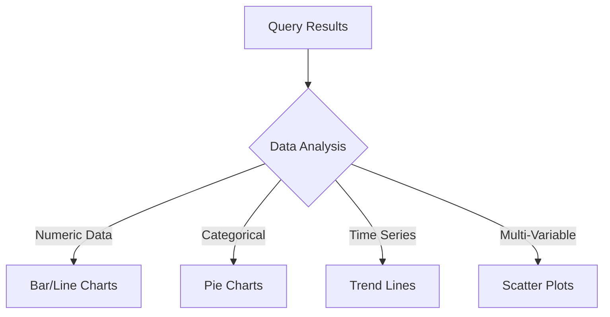

# Text2SQL AI Assistant with Visualization

A powerful AI agent that transforms natural language questions into SQL queries, executes them against a database, and generates interactive visualizations. Built with CrewAI, Streamlit, and Plotly.

## Features

- **Natural Language to SQL**: Ask questions in plain English
- **Multi-Agent System**: Specialized agents for SQL generation, validation & analysis
- **Interactive Visualizations**: Auto-detected charts (bar, line, pie, scatter)
- **Complex DB Handling**: Supports Sakila DB with 23 interconnected tables
- **Query Safety**: Prevents SQL injection and harmful operations
- **Data Export**: Download results as CSV/JSON

## Tech Stack


## Installation

### 1. Clone Repository
```bash
git clone https://github.com/gitprajapati/crewai-sql-visual-agent.git
cd crewai-sql-visual-agent
```

### 2. Initialize Environment
```bash
uv init
uv venv
```

### 3. Activate Virtual Environment
```bash
# Linux/MacOS
source .venv/bin/activate

# Windows
.\.venv\Scripts\activate
```

### 4. Install Dependencies
```bash
uv sync
```

### 5. Set Up Sakila Database
1. Download Sakila database:
   - [sakila-schema.sql](https://downloads.mysql.com/docs/sakila-db.zip)
   - [sakila-data.sql](https://downloads.mysql.com/docs/sakila-db.zip)
2. Load into MySQL:
```sql
mysql> SOURCE sakila-schema.sql;
mysql> SOURCE sakila-data.sql;
```

### 6. Configure Environment Variables
Create `.env` file:
```env
DB_HOST=localhost
DB_USER=root
DB_PASSWORD=adminpass
DB_NAME=sakila
DB_PORT=3306

# Choose one LLM provider
GROQ_API_KEY=your_groq_key
# OR
GEMINI_API_KEY=your_gemini_key
# OR
REPLICATE_API_TOKEN=your_replicate_token
```

## Usage

```bash
uv streamlit run main.py
```

## Configuration Options

### Database Settings
```python
# DatabaseConfig in sql_connection_tool.py
self.host = os.getenv("DB_HOST", "localhost")
self.username = os.getenv("DB_USER", "root")
self.password = os.getenv("DB_PASSWORD", "adminpass")
self.database = os.getenv("DB_NAME", "sakila")
self.port = int(os.getenv("DB_PORT", 3306))
```

### LLM Selection
Modify `Text2SQLAgent` class to use your preferred LLM:
```python
# In Text2SQLAgent.__init__
self.llm = LLM(
    model="gemini/gemini-2.5-flash-preview-04-17",  # Gemini
    # model="groq/llama-3.3-70b-versatile",         # Groq
    # model="replicate/meta/meta-llama-3-8b-instruct" # Replicate
    temperature=0.3
)
```

## Features Overview

### Natural Language Processing


### Visualization Engine


## Sample Questions

1. "Show monthly revenue trends"
2. "Top 10 customers by rental count"
3. "Most popular film categories by store"
4. "Average rental duration by rating"
5. "Revenue comparison between stores"

## Troubleshooting

**MySQL Connection Issues:**
- Verify Sakila DB is loaded: `SHOW TABLES FROM sakila;`
- Check user privileges: `GRANT ALL PRIVILEGES ON sakila.* TO 'root'@'localhost';`

**API Key Errors:**
- Ensure correct .env configuration
- Verify provider account status

**Visualization Issues:**
- Try different chart types from dropdown
- Check data types in results
